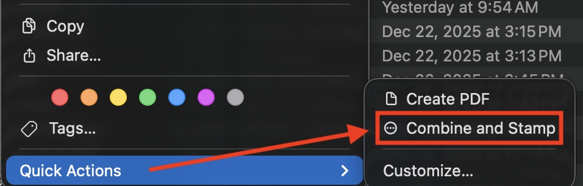
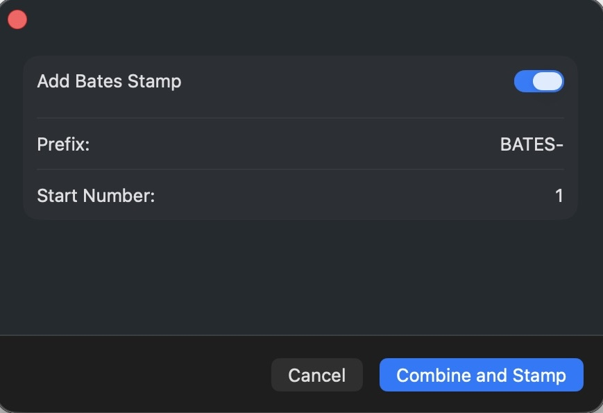

# Combine and Stamp Quick Action

Combine selected PDFs and images into a single PDF and optionally apply a Bates stamp.

> **Note:** This project was 100% AI-generated.

## Installation

1. Download the file from the [Releases](https://github.com/MatthewNuzum/Combine-and-Stamp/releases) page.
1. Move `PDFCombineStamp.app` into your **Applications** folder.
2. Double-click **Combine and Stamp**.
3. When prompted, click **Install** to add the Finder Quick Action.

## Usage

1. In Finder, select multiple files (PDFs and images are supported).
2. Right-click (or Control-click), then choose:
   - **Quick Actions**
   - **Combine and Stamp**
3. Use the pop-up dialog to combine your files and optionally add a Bates stamp.

## Permissions & Transparency

This app is designed to operate on files you explicitly select in Finder and to write the resulting PDF in the same folder. It does not transmit data over the network.

When you run the Quick Action, macOS may prompt for permissions related to:

- **Finder automation** (to select or reveal the output file in Finder).

If you don’t want to grant automation permissions, you can still use the app; it will just skip any automation-related behavior.

## Security Notes

- The app processes PDFs and images locally on your machine.
- Only files you select in Finder are opened and processed.
- The output PDF is created in the same directory as the first selected file (or Desktop if unavailable).

## License

This project is released into the public domain under **CC0 1.0**.

You are free to copy, modify, distribute, and use it for any purpose without asking permission.

See: https://creativecommons.org/publicdomain/zero/1.0/
